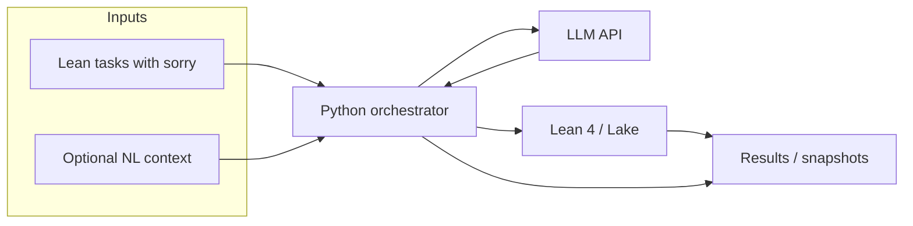

# kalinov-bridge

[](https://github.com/bartrosa/kalinov-bridge/actions/workflows/ci.yml)
[](LICENSE)

**Status: early scaffold / WIP** — API and Lean benchmark layout will evolve.

Bridge between **natural language / LLM output** and **formal proofs in Lean 4**: run models against proof tasks, verify with `lake build`, record metrics (success rate, errors, timings).



## Requirements

- **Python** 3.12+ recommended ([uv](https://docs.astral.sh/uv/) for env and tasks).
- **Lean 4** + Lake — workspace under [`lean/`](lean/); CI runs `lake build` there via [lean-action](https://github.com/leanprover/lean-action) (with Mathlib cache). Details: [docs/development.md](docs/development.md).
- **LLM API key** in the environment when you run experiments (e.g. `OPENAI_API_KEY`) — orchestration code is still minimal.

## Quick start

```bash
git clone https://github.com/bartrosa/kalinov-bridge.git
cd kalinov-bridge
uv sync --group dev
uv run ruff check .
uv run ruff format --check .
uv run mypy .
uv run pytest
```

Optional — same flows via **Make**: `make check`, `make run-demo` (see [docs/development.md](docs/development.md)). Hello-world E2E script: `uv run python experiments/hello_e2e.py`.

Enable commit-msg checks (Conventional Commits):

```bash
git config core.hooksPath .githooks
```

### Optional: branch name helpers

If you use a small global script + aliases (e.g. `git feat my-task` → branch `feat/my-task` from `main`), see [CONTRIBUTING.md](CONTRIBUTING.md#workflow). This repo does not require it—only clear branch names and green CI.

## Docs

- [Development setup](docs/development.md)
- [Documentation index](docs/README.md)

## Contributing

See [CONTRIBUTING.md](CONTRIBUTING.md). Issues and PRs welcome.

## License

Licensed under the **Apache License, Version 2.0** — see [LICENSE](LICENSE).
