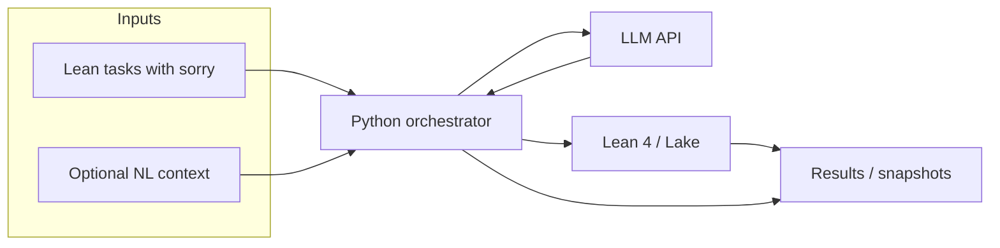

# kalinov-bridge

[](https://github.com/bartrosa/kalinov-bridge/actions/workflows/ci.yml)
[](LICENSE)

**Status: early scaffold / WIP** — API and Lean benchmark layout will evolve.

Bridge between **natural language / LLM output** and **formal proofs in Lean 4**: run models against proof tasks, verify with `lake build`, record metrics (success rate, errors, timings). Optional **mining** (off by default) can pull text from sources such as arXiv and write candidate `.feature` files for **human review** before they enter any suite — see [Mining](#mining).



## Requirements

- **Python** 3.12+ recommended ([uv](https://docs.astral.sh/uv/) for env and tasks).
- **Lean 4** + Lake — workspace under [`lean/`](lean/); CI runs `lake build` there via [lean-action](https://github.com/leanprover/lean-action) (with Mathlib cache). Details: [docs/development.md](docs/development.md).
- **LLM API key** in the environment when you run experiments (e.g. `OPENAI_API_KEY`) — orchestration code is still minimal.

### Lean integration (`kalinov check --prover lean4`)

For the real Lean backend you need **[elan](https://github.com/leanprover/elan)** so `lean` and `lake` are on your `PATH` (one-line install: see [elan](https://github.com/leanprover/elan#installation)).

1. Build the **vendored prover runtime** (first run compiles Mathlib; expect a long wait):

   ```bash
   cd provers/lean/runtime && lake build
   ```

2. Run checks on Gherkin examples (obligations are steps with `kind=claim` in scenarios tagged `@lean`):

   ```bash
   uv run kalinov check --prover lean4 examples/gauss_sum.feature --runs-dir runs
   ```

Exit code **3** means the toolchain was not found; the CLI prints a short elan install hint. Telemetry for each call is written under `runs/<run_id>/prover_calls.jsonl` when using the default runs directory.

### ForTheL → Lean bridge

For steps that the ForTheL interpreter classifies as claims, `kalinov check --prover lean4` can run a **Naproche** subprocess (default: `naproche <tmp.ftl> --lean`) to obtain Lean text, then pass that to `LeanProver.check`. Outcomes are recorded in `runs/<run_id>/forthel_translations.jsonl` (per-step outcome, duration, exit code, captured output size; Naproche output is truncated at 32 KiB). If translation is **skipped** (e.g. Naproche not on `PATH`), the CLI prints a `SKIP FORTHEL …` line and does not treat that as a hard failure. If translation **fails** or the subsequent Lean check fails, the run fails (exit code 1). Use **`--no-forthel`** to turn off the bridge and rely only on the usual Lean obligation path (so ForTheL claims are not translated via Naproche).

Example: [`examples/forthel_to_lean.feature`](examples/forthel_to_lean.feature).

## Quick start

```bash
git clone https://github.com/bartrosa/kalinov-bridge.git
cd kalinov-bridge
uv sync --group dev
uv run ruff check .
uv run ruff format --check .
uv run mypy .
uv run pytest
```

Optional — same flows via **Make**: `make check`, `make run-demo` (see [docs/development.md](docs/development.md)). Hello-world E2E script: `uv run python experiments/hello_e2e.py`.

Enable commit-msg checks (Conventional Commits):

```bash
git config core.hooksPath .githooks
```

### Optional: branch name helpers

If you use a small global script + aliases (e.g. `git feat my-task` → branch `feat/my-task` from `main`), see [CONTRIBUTING.md](CONTRIBUTING.md#workflow). This repo does not require it—only clear branch names and green CI.

## Mining

The `kalinov mine` command is **opt-in** and **network-gated** (`--network`); it emits candidate Math-Gherkin files under `corpus/mined/` for manual editing before they are added to a benchmark suite. Conventions, attribution fields, and license responsibility are documented in [corpus/README.md](corpus/README.md).

## Docs

- [Development setup](docs/development.md)
- [Documentation index](docs/README.md)

## Contributing

See [CONTRIBUTING.md](CONTRIBUTING.md). Issues and PRs welcome.

## License

Licensed under the **Apache License, Version 2.0** — see [LICENSE](LICENSE).
